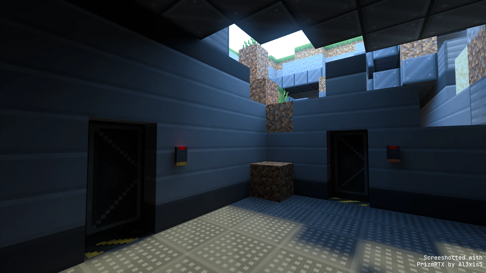

<div align="center">


<hr/>

[](https://github.com/lc-studios-mc/scp-dystopia/releases)
[](https://github.com/lc-studios-mc/scp-dystopia/commits/main/)

[](https://discord.gg/K2mxsJ2trE)
[](https://mcpedl.com/scp-dystopia-addon/)

**SCP: Dystopia** is an add-on for Minecraft Bedrock, based on the works of the [SCP Foundation](https://scp-wiki.wikidot.com/) community.



</div>

## :placard: Roadmap

**Version 2.0.0 (full rework) is currenntly under development!**

<ins>My main priority is to restore all SCPs from v1.8.1.</ins>

While that's the main thing, I'm also going to add other important aspects in SCP universe such as SCP Foundation staff, MTF units, and *Groups of Interest* (like Chaos Insurgency and GoC).

I'm also going to add decent survival support and lore behind those ruined facilities scattered around the world. But, they're very likely to be added after many other features are added.

I won't make something like a big To-Do list during development, as I found it to be quite distracting for me.

Thank you for reading! You can download the add-on from [here](https://github.com/lc-studios-mc/scp-dystopia/releases).

## :inbox_tray: Installation

1. Download add-on file (`.mcaddon`).
1. Open the downloaded file in Minecraft.
1. Minecraft should automatically import the add-on.

If you fail on step 2 or 3, try installing manually:

1. Download add-on file (`.zip`).
1. Extract the downloaded zip file.
1. Move the behavior pack folder named *SCPDY_BP* into `.../com.mojang/behavior_packs`
1. Move the resource pack folder named *SCPDY_RP* into `.../com.mojang/resource_packs`
1. Packs should be installed.

The location of `com.mojang` folder differs in each platform.

On Windows OS, they are located under:

```
{USER HOME}\AppData\Local\Packages\Microsoft.MinecraftUWP_8wekyb3d8bbwe\LocalState\games
```

**Some devices do not allow you to do this.**
In that case, please find other workaround. I don't know how.

## :handshake: Contributing

Contributions of all kinds are welcome:

- Code
- Artworks
- Textures
- 3D models
- Sound design
- ...

See [CONTRIBUTING.md](./.github/CONTRIBUTING.md) for instructions.

## :computer: Developer Guide

See [DEVELOPER.md](./DEVELOPER.md) for developer guide.

## :pencil: Attributions

See [ATTRIBUTIONS.md](./ATTRIBUTIONS.md) for attributions.

## :page_with_curl: Credits

See [CREDITS.md](./CREDITS.md) for credits.

## :balance_scale: License

Since January 7, 2025, this repository contains material under two different licenses.

### Source Code
All source code in this repository is licensed under the MIT License.
See [LICENSE-MIT](./LICENSE-MIT) for the full license text.

### Assets
All assets (images, audio, etc.) are licensed under CC-BY-SA.
See [LICENSE-CC-BY-SA](./LICENSE-CC-BY-SA) for the full license text.

> [!IMPORTANT]
> Until then, all source code and assets were licensed under CC-BY-SA.

## :mailbox: Contact

For bug reports, feature suggestions, and questions, please use our [Discord server](https://discord.gg/K2mxsJ2trE) (my user ID is `luckedcoronet45`).

Our email address: info@lc-studios.net
